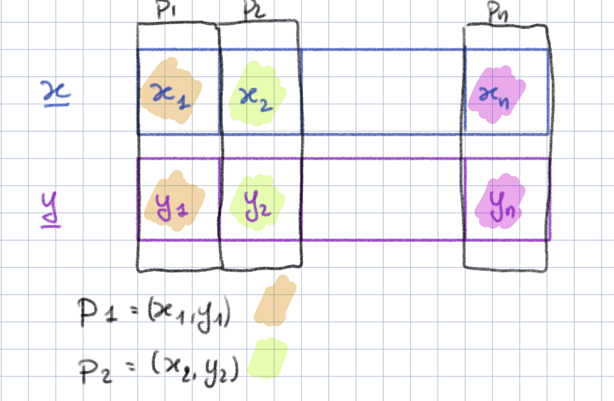
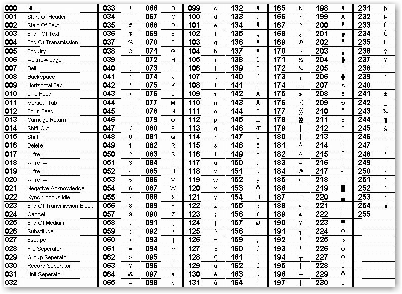

# Laboratorio 7: Caricamento e analisi dati. Ordinamento array. Analisi statistica di un testo.

# Esercizio 1 (warm up)

Caricare i dati contenuti nel file __dati_int.dat__ in un vettore __int dati[10]__. Quindi:
- Determinare e stampare a video la  il valore più grande e il valore più piccolo, insieme alle loro posizioni nell'array.
- Ordinare i dati in ordine crescente. Stampare a video il vettore ordinato. Stampare sul file __dati_int_ord.dat__ il vettore dei dati ordinato.

# Esercizio 2
Il file __dati_header.dat__ (oggetto dell'esercizio 7 del Laboratorio 6) contiene dei dati razionali in singola precisione. Il file, ricordiamo, è strutturato come segue:
- Il primo valore è un numero intero, chiamiamolo __ndati__ che indica l'ampiezza del campione;
- Gli __ndati__ valori successivi sono i dati veri e propri.

Nell'esercizio 7 del Laboratorio 6 abbiamo determinato la media e la deviazione standard del campione, e abbiamo ripulito il vettore dei dati da eventuali outliers.

1- Estendere la soluzione dell'esercizio 7 del Laboratorio 6, salvando i dati "scremati" dagli outliers in un file __dati_header_clean.dat__ contenente:
- il numero di dati sopravvissuti alla scrematura
- ...seguito dai dati, uno per riga.

Creare un nuovo programma che, caricati i datidal file __dati_header_clean.dat__ in un vettore __float dati[100]__, 
1- determini e stampi a video il dato più grande e il dato più piccolo del campione, e le loro posizioni nell'array.
2- Ordini i dati in ordine non-decrescente.
3- Determini la mediana (o 50-esimo percentile _q50_) del campione. Ricordiamo che la mediana è il valore numerico _q50_ che divide il campione in due parti, della stessa dimensione, la prima metà contenente tutti i valori minori della mediana e la seconda contenente tutti i valori maggiori della mediana. Per un campione di dimensione dispari, n=2k+1 la mediana è il valore del campione che "sta nel mezzo" del vettore ordinato, ovvero d[k+1]. Per un campione di dimensione pari (n=2k) la mediana è definita come 

q50 = 0.5*(d[k]+d[k+1]);

ATTENZIONE: d[k] indica il k-esimo elemento del campione, non la posizione nel vettore (ordinato) che sarà __dati[k-1]__.

4- Stampare quindi a video E registrare sul file __risultati.dat__

- Il valore massimo e minimo del campione.
- I primi 3 e gli ultimi 3 elementi del vettore ordinato
- Il valore della mediana.

# Esercizio 3
Il file __punti.dat__ contiene un numero non precisato, ma minore  di 30, di coordinate di punti sul piano cartesiano. In particolare, su ogni riga del file sono indicate l'ascissa e l'ordinata di un punto come valori razionali in singola precisione

Predisposti due vettori __float ascisse[30]__ e __float ordinate[30]__:

1- Contare in numero di punti descritti nel file.
2- Caricare le ascisse e le ordinate dei punti rispettivamente nel vettore __ascisse__ e __ordinate__.
3- Determinare il punto più vicino all'origine e stamparne le coordinatre.
4- Determinare il punto più lontano dall'origine e stamparne le coordinate.
5- Ordinare i punti in ordine di distanza dall'origine crescente. Attenzione: dovrete operare "in parallelo" sui due vettori, in modo da mantenere allineate le ascisse e le ordinate.

Stampare i risultati dei punti 3 e 4 sul file __res_punti.dat__. Stampare sullo stesso file le coordinate dei tre punti più vicini all'origine e dei tre punti più lontani dall'origine.

# Esercizio 4

Il file __dc_inf_1.txt__ contiene il primo canto dell'Inferno di Dante. Si tratta di un normalissimo file, a parte il contenuto che è, per i nostri standard...un po` "anomalo".

L'obiettivo finale di questo esercizio sarà quello di fare dei conteggi sulle occorrenze dei diversi caratteri, con particolare attenzione a quelli alfabetici.

Ricordiamo che la codifica ASCII associa ogni carattere ad un intero positivo tra 0 e 255. Ogni carattere è infatti memorizzato usando 8 bit (1 byte). 

Per poter fare i conteggi che ci servono è necessario effettuare una lettura "fine" del file. L'operatore di estrazione da stream ">>" è purtroppo troppo "smart": salta spazi e a capo, che noi invece vogliamo considerare. Useremo invece la funzione (in realtà è un _metodo_) _get()_. Supponendo di avere uno stream di input __ifstream file_in__ aperto e associato ad un file la chiamata di 

__file_in.get()__ 

restituisce il prossimo carattere nel file. In particolare, data una variabile __char c__ l'istruzione 

__c = file_in.get()__ 

ha l'effetto di registrare nella variabile __c__ il carattere letto dallo stream.

Scrivere un programma che:

1. Dichiari un vettore __counts__ di 256 elementi di tipo __int__ e ne inizializzi tutte le componenti a zero. Questo vettore sarà usato per conteggiare le occorrenze dei caratteri.
2. Per ogni carattere letto da file e registrato in una variabile  __char c__ incrementi il vettore __counts__ di uno in posizione __c__, ovvero __counts[(int) c ]++__. Notate che abbiamo usato la codifica ASCII per indirizzare l'array; la conversione (cast) ad __int__ (ovvero __(int) c__) non è in realtà necessaria, considerando che un __char__ può anche essere usato come un intero senza segno codificato su 8 bit. 
NOTA: usare il "ciclo Spoletini" per effettuare la lettura da file; ricordarsi di controllare, come al solito, la corretta apertura dello stream.
3. Finito il conteggio delle occorrenze dei caratteri/simboli di interpunzione/spazi ecc..., determinare il carattere con maggioni occorrenze e stampare a video il carattere e il numero di occorrenze e il numero di caratteri complessivamente letto da file.

4. Ispezionando la tabella ASCII riportata qui sotto, determinare:
4.1 Il carattere <ins>alfabetico</ins> con maggiori occorrenze. Per fare questo esercizio potrebbe essere utile usare la funzione __findMaxRange__ discussa a lezione, opportunamente modificata.
4.2 Il numero di spazi (ASCII).
4.3 Il numero di "a capo" (o carriage return).

5. Creato il vettore di caratteri __char chars[256]__, inserire in ciascuna componente il carattere ASCII corrispondente. Per esempio, la componente di indice 97 dovrà contenere il carattere 'a', la componente di indice 98 dovrà contenere il carattere 'b' e così via. OSSERVAZIONE: per inserire il carattere ascii corrispondente basterà interpretare un "opportuno" intero tra 0 e 255 come carattere...

Da qui in avanti ci concentreremo solo sui caratteri alfabetici (sia lettere maiuscole che minuscole), ovvero i caratteri con codifica tra 65 e 122. Si tratta di 58 caratteri complessivi.

6. Definire un vettore __int counts_red[58]__ e un vettore __char chars_red[58]__. Assegnare a ciascuna componente del vettore __chars_red__ un carattere (seguite l'ordinamento della codifica ASCII) e all'omologo elemento di __counts_red__ il numero di occorrenze del carattere.
6. Ordinare i caratteri in ordine di occorrenza decrescente. Stampare a video e sul file __risultati_counts.dat__ il risultato dell'ordinamento. ATTENZIONE: come nel caso dell'esercizio sui punti (Esercizio 3), il vettore dei caratteri e quello dei conteggi dovranno essere permutati in parallelo, in modo tale che, alla fine dell'ordinamento __counts_red[i]__ contenga il numero di occorrenze del carattere __chars_red[i]__.

