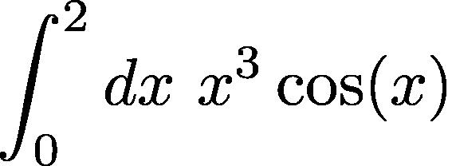
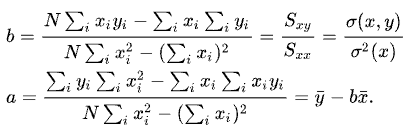
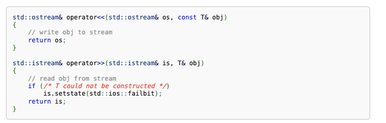

# Laboratorio 10: Metodi Monte Carlo, Simulazione semplice esperimento e ancora sul caricamento dati da file.

## Esercizio 1

Creiamo la nostra libreria per la generazione di numeri casuali. Creati, e salvati in modo opportuno, i file __libCaso.C__ e __libCaso.h__, dichiarare e definire le seguenti funzioni:

- __double randUniforme(double minimo, double massimo)__: restituisce un valore estratto uniformemente a caso in $[\text{minimo},\text{massimo}]$.

- __double randGaussiano(double media, double stdVar)__: restituisce un numero estratto a caso da una popolazione Gaussiana di media e deviazione standard assegnata usando la trasformazione di Box-Muller. NOTA: sappiamo che Box-Muller sarebbe in grado di restituire due numeri estratti da una popolazione gaussiana: ne buttiamo via uno per semplicità.

- __void impostaSeme()__: deve richiamare al suo interno __srand(time(NULL))__ per impostare il seme del generatore di numeri casuali.

## Esercizio 2
Stimiamo $\pi$ usando la tecnica Monte Carlo discussa a lezione. Supporremo che il quarto di  circonferenza (nel primo quadrante) _A_ abbia centro nel punto O=(0,0) e raggio unitario. I punti verranno invece sparati a caso nel quadrato _E_ di lato 1 con spigolo in basso a sinistra nell'origine.  Struttureremo la soluzione come segue:

1. La funzione 

__bool isInsideCircle(puntoR2 p, double r, puntoR2 centro)__

 che, preso in ingresso un 
 
 __struct puntoR2{
   double x;
   double y;
 };__
 
  restituisca __true__ se il punto corrispondente cade all'interno di una circonferenza di raggio __r__ centrata nel punto __centro__, __false__ atrimenti. 

2. Definire una funzione 

__int countWithin(int n, double r)__

che, preso in ingresso un valore intero __n__ e un raggio __r__ , estragga __n__ punti a caso nel quadrato _E_ di lato __r__ e spigolo in basso a sx  nell'origine $O=(0,0)$ degli assi; la funzione deve restituire il numero di punti che cadono all'interno di una circonferenza di ragio __r__ e centro nell'origine. A tal fine, la funzione dovrà usare la funzione __isInsideCircle__ introdotta al punto precedente, con __centro__ nell'origine degli assi.

3. Definire una funzione

__double rilev(int n, double r)__

che preso in ingresso il numero di punti a caso da utilizzare, fornisca una <u>rilevazione</u> di $\pi$ usando la relazione vista a lezione. 

4. Fatto questo, scrivere un programma che fornisca una stima di $\pi$ attraverso _M=50_ rilevazioni, ciascuna delle quali usa _N=100_ punti estratti a caso. Il programma dovrà quindi calcolare la media e la varianza del campione del vettore di _M=50_ rilevazioni (usate un vettore dinamicamente allocato per registrare le rilevazioni). La media del campione sarà  la nostra stima di $\pi$, la varianza invece una misura della qualità  della misura. Cosa succede alla varianza calcolata se invece di 100 punti usassimo 200,300,400,500  punti per ogni rilevazione? Provate a ripetere l'esperimento di misura usando 200,300,400,500 punti ad ogni rilevazione e, per ogni taglia del numero di punti, registrare il valore della media e della varianza su un file __esperienzaPi.dat__, corredato da opportune didascalie.

## Esercizio 3
Fornire una stima Monte Carlo dell'integrale, usando, con attenzione, una delle due strategie discusse a lezione.

 
 
 usando M=20 rilevazioni ciscuna delle quali usa _k=50_ punti estratti a caso nell'intervallo [0,2]. FYI: Il valore esatto dell'integrale, che si può calcolare tramite integrazione per parti, è -0.134071. Calcolare la stima (misura) dell'integrale (media delle _M_ misure) e la deviazione standard del campione delle misure. Cosa succede se usiamo _k=100,150,200_ punti per ogni misura? Come nell'esercizio precedente, registrate i risultati in un file __esperienzaInt.dat__.

 ## Esercizio 4

 Scrivere una funzione

 __double rileva(double time, double x0,double v,double mu, double sig)__

 che, preso in ingresso un tempo __time__ calcoli la posizione  di un punto materiale che si muova secondo la legge

 $x(t) = x0 + v t$

 a cui somma un valore casuale $\epsilon$  estratto a caso da una popolazione _normale_ di media $\mu =$ __mu__ e deviazione standard $\sigma$ = __sig__. Il valore generato sarà pertanto uguale a 

 $y(t) = x(t)+ \epsilon, \ \epsilon \sim N(\mu,\sigma)$

 Fissati i valori __x0 = 2, v = 0.3__, usare la funzione __rileva__ per generare 100 coppie $(t_i,y_i = y(t_i))$ con $t_i = 0.2 * i, i=0,1,\ldots,99$. Registrare le coppie generate su un file dal nome __rilevazioni.dat__. Ogni riga del file dovrà contenere una coppia $t_i$ $y_i$. 
 
 IMPAGINAZIONE: ciascun valore di una coppia deve essere registrata sul file in un campo di ampiezza 12. Usare il modificatore __setw(...)__ della libreria __iomanip__.

 ## Esercizio 5
 Caricare i dati contenuti nel file __rilevazioni.dat__ in un vettore di __puntoR2__ allocato dinamicamente. Fatto questo, determinate i coefficienti della regressione

 _y(x) = a+ b x_

 dove l'intercetta _a_ e il coefficiente angolare _b_ sono stimati  attraverso le relazioni:

 
  
 A tal fine potrebbe essere comodo definire una funzione __puntoR2 linearReg(puntoR2 data[], int ndata)__ che restituisce una t-upla __puntoR2__ dove il primo campo, __x__, conterrà il coefficiente angolare e il secondo campo, __y__, conterrà l'intercetta. 

 ## Esercizio 6, avanzato: lettura e scrittura smart tramite overloading degli operatori << e >>.

La documentazione del linguaggio ci dice

Ammissibilmente la scrittura è abbastanza criptica, e la sua comprensione richiederebbe un po' di sforzo...

Concentriamoci, per il momento su

__std::ostream& operator<<(std::ostream& os, const T& obj)__

Quello che ci dice la definizione, parziale (manca un pezzo, che sarà la parte interessante) della funzione __operator<<__ è che questa prende in ingresso un __ostream& os__, ovvero un riferimento a __ostream__ e un __obj__, costante, di tipo __T__ e restituisce un riferimento a __ostream__. 

Ci basti sapere che:

- __operator<<__  è il nome esteso dell'operatore __<<__ che usiamo da tempo, per esempio per la stampa a video  (__cout<<__) e per la stampa su file (__file_out << dato__).
- __ostream__: è il tipo di uno stream di output, ovvero di un _flusso_ di uscita di dati dal programma. Sia __cout__ che __ofstream file_out__ sono __ofstream__.
- __T obj__ è una variabile di tipo __T__ non altrimenti specificato.

Questa scrittura ci fornisce le indicazioni per quella che potremmo definire una stampa _smart_ di un tipo di dato da noi definito a video o su file. 

In modo simile __operator>>__ definisce la signature generica di una funzione di lettura da __istream__, ovvero stream di ingresso; considerate che __cin__ e __ifstream file_in__ sono entrambi esempi stream di ingresso.

Il file __OperatorOverloading/outOp.C__ esemplifica la definizione di opportune funzioni di lettura e scrittura della t-upla 

__struct sfera{
  char col; 
float diam;
};__

Definite la libreria __sfera.h/C__ che:

- Definisca la t-upla __sfera__ e metta a disposizione le funzioni di:
1. Lettura di una sfera,
2. Scrittura di una sfera,

(copiate pure dal file __OperatorOverloading/outOp.C__). 

Noterete che un approccio di questo tipo consente di provvedere alla stampa e alla  lettura di t-uple verso/da file e tastiera in modo omogeneo.

Provate quindi a scrivere un programma che: 

1. Carichi 5 sfere in un vettore di 5 __sfera__, statico, leggendo i valori da tastiera e le stampi poi sul file __provaSfera5.dat__.
2. Carichi le sfere descrite nel file __sfere.dat__ in un vettore di __sfera__ allocato dinamicamente e stampi le prime 3 e le ultime 3 sfere lette a video.

In entrambe i casi la lettura, da file o da tastiera, delle sfere dovrà essere fatta usando la funzione __>>__, mentre le stampe dovranno essere fatte usando la funzione __<<__.

Fatto questo, pensate a come modificare i codici scritti in passato per la manipolazione di sfere...

Scrivete quindi una analoga libreria per la t-upla __puntoR2__, ovvero una libreria che 

1. Dichiari la t-upla
2. Metta a disposizione le funzioni per la stampa e la lettura di __puntoR2__ verso/da file e/o tastiera.
 
